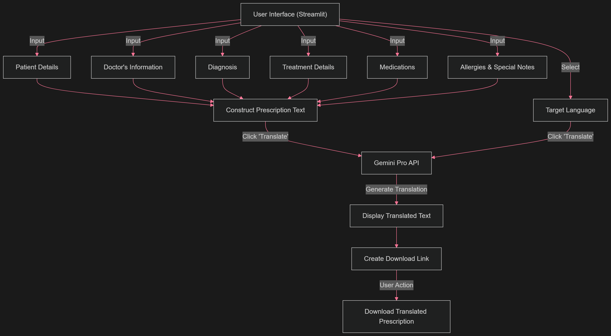
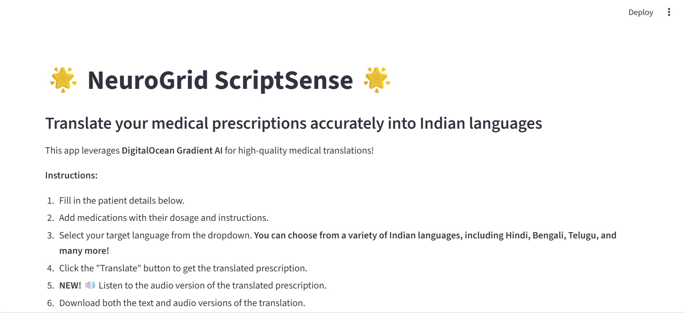
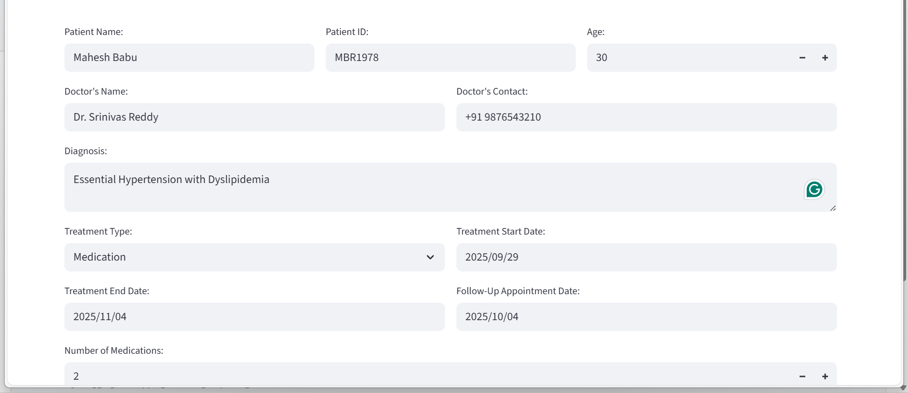
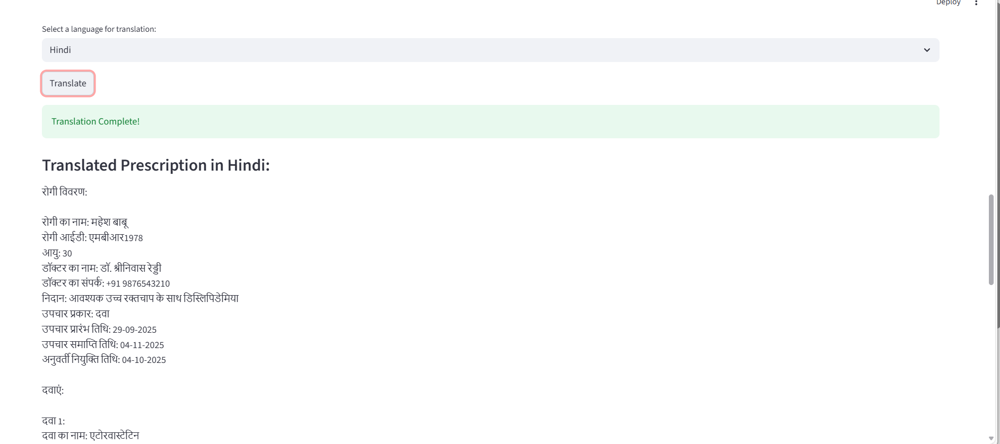
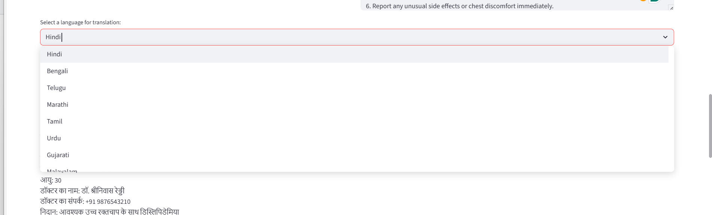
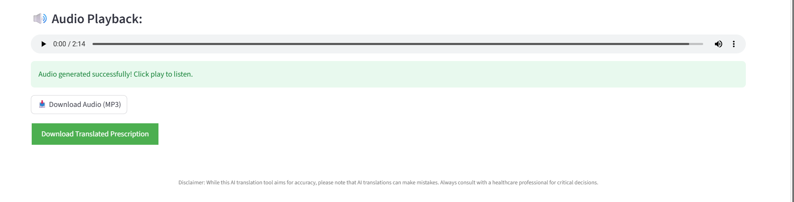

# NeuroGrid ScriptSense

**AI-Powered Medical Prescription Translation with Text-to-Speech**

NeuroGrid ScriptSense is an advanced Streamlit-based web application that leverages **DigitalOcean Gradient AI** (Llama 3.3 70B) to accurately translate medical prescriptions into 27+ Indian languages. This innovative tool bridges language barriers in healthcare, ensuring patients and healthcare providers can communicate effectively regardless of their native language.

---

## ✨ Key Features

### 🌍 **Multi-Language Translation**

- Translate medical prescriptions into **27+ Indian languages**
- Supports: Hindi, Bengali, Telugu, Marathi, Tamil, Urdu, Gujarati, Malayalam, Kannada, Punjabi, and many more
- Preserves medical terminology and dosage accuracy

### 🔊 **Text-to-Speech (NEW!)**

- **Convert translated prescriptions to audio** format
- Play audio directly in the browser
- Download audio as MP3 files
- Supports all Indian languages with native pronunciation
- Perfect for patients with reading difficulties or visual impairments

### 📄 **Comprehensive Prescription Management**

- User-friendly interface for patient details and medication information
- Support for multiple medications per prescription
- Fields for diagnosis, treatment details, and follow-up appointments
- Download translated prescriptions as text files
- Professional formatting for medical documentation

### 🚀 **Powered by Advanced AI**

- **DigitalOcean Gradient AI** - Serverless inference
- **Llama 3.3 70B Instruct Model** - State-of-the-art translation quality
- Fast and accurate translations
- Medical terminology preservation

### ♿ **Accessibility Features**

- Audio playback for visually impaired patients
- Multiple download formats (text and audio)
- Clear, professional layout
- Mobile-responsive design

---

## 📸 Screenshots


_System Architecture_


_Main Interface_


_Prescription Input_


_Medications_


_Translation Results_


_Multi-language Support _


_Text to Speech audio output_

---

## 🚀 Quick Start

### Prerequisites

- Python 3.10 or higher
- DigitalOcean Gradient AI Model Access Key

### Installation

1. **Clone the repository:**

```bash
git clone https://github.com/preethamresearch/hacktoctober.git
cd hacktoctober
```

2. **Install dependencies:**

```bash
pip install -r requirements.txt
```

3. **Configure API Key:**

   - Get your Model Access Key from [DigitalOcean Console](https://cloud.digitalocean.com/account/api/tokens)
   - Open `main.py` and update line 13:

   ```python
   GRADIENT_MODEL_ACCESS_KEY = "your_actual_api_key_here"
   ```

4. **Run the application:**

```bash
streamlit run main.py
```

5. **Access the app:**
   - Open your browser to: http://localhost:8501

---

## 📖 Usage Guide

### Step 1: Enter Patient Information

1. Fill in patient name, ID, and age
2. Add doctor's name and contact information
3. Enter diagnosis details

### Step 2: Add Medications

1. Specify the number of medications
2. For each medication, enter:
   - Medication name
   - Dosage instructions
   - Frequency (e.g., "Twice daily")
   - Duration (e.g., "7 days")

### Step 3: Additional Information

1. Add known allergies (if any)
2. Include special notes or instructions

### Step 4: Translate

1. Select target language from 27+ options
2. Click **"Translate"** button
3. View the translated prescription

### Step 5: Audio & Download

1. **🔊 Listen to audio:** Click play on the audio player
2. **📥 Download text:** Click "Download Translated Prescription"
3. **📥 Download audio:** Click "Download Audio (MP3)"

---

## 🌐 Supported Languages

Full Text-to-Speech support for:

- **Hindi** (हिन्दी)
- **Bengali** (বাংলা)
- **Telugu** (తెలుగు)
- **Marathi** (मराठी)
- **Tamil** (தமிழ்)
- **Urdu** (اردو)
- **Gujarati** (ગુજરાતી)
- **Malayalam** (മലയാളം)
- **Kannada** (ಕನ್ನಡ)
- **Punjabi** (ਪੰਜਾਬੀ)
- **Assamese** (অসমীয়া)
- **Odia** (ଓଡ଼ିଆ)
- **Sindhi** (سنڌي)

And 14+ more regional languages!

---

## 🛠️ Technologies Used

### AI & Machine Learning

- **DigitalOcean Gradient AI** - Serverless inference platform
- **Llama 3.3 70B Instruct** - Advanced language model
- **Google Text-to-Speech (gTTS)** - Audio generation

### Web Framework

- **Streamlit** - Interactive web application
- **Python 3.10+** - Core programming language

### Data Processing

- **Pandas** - Data manipulation
- **NumPy** - Numerical operations

### Additional Libraries

- **Requests** - HTTP requests
- **Base64** - File encoding
- **BytesIO** - Audio processing

---

## 📁 Project Structure

```
NeuroGrid-ScriptSense/
├── main.py                          # Main application
├── requirements.txt                 # Python dependencies
├── README.md                        # Project documentation
├── SETUP.md                         # Setup guide
├── MIGRATION_GUIDE.md              # Gradient AI migration guide
├── TTS_FEATURE_GUIDE.md            # Text-to-Speech documentation
├── QUICK_START.md                  # Quick start guide
├── QUICK_REFERENCE.md              # Command reference
├── check_env.py                    # Environment verification
├── run_app.bat                     # Windows batch script
├── run_app.ps1                     # PowerShell script
├── .gitignore                      # Git ignore rules
├── .env.example                    # Environment variable template
└── Screen/                         # Screenshots and diagrams
    ├── medical-prescription-blockdiagram.png
    └── img-*.png
```

---

## 🎯 Use Cases

### For Healthcare Providers

✅ Communicate with patients in their native language  
✅ Reduce medication errors due to language barriers  
✅ Provide audio instructions for better understanding  
✅ Generate professional multilingual documentation

### For Patients

✅ Understand prescriptions in native language  
✅ Listen to audio version if unable to read  
✅ Share prescriptions with family/caregivers  
✅ Better medication compliance

### For Pharmacists

✅ Verify prescriptions in multiple languages  
✅ Communicate dosage instructions clearly  
✅ Reduce dispensing errors

---

## 📚 Documentation

- **[Setup Guide](SETUP.md)** - Detailed installation instructions
- **[TTS Feature Guide](TTS_FEATURE_GUIDE.md)** - Text-to-Speech documentation
- **[Migration Guide](MIGRATION_GUIDE.md)** - Gradient AI migration from Gemini
- **[Quick Reference](QUICK_REFERENCE.md)** - Command cheat sheet
- **[Quick Start](QUICK_START.md)** - Getting started guide

---

## 🔐 Security & Privacy

- ✅ **No data storage** - Translations generated on-demand
- ✅ **Local processing** - Audio created in memory
- ✅ **No cloud upload** - Patient data stays secure
- ✅ **API key protection** - Environment variable support

**⚠️ Important:** Never commit your API key to version control. Use environment variables or `.env` files (already in `.gitignore`).

---

## 🤝 Contributing

We welcome contributions! Here's how you can help:

1. Fork the repository
2. Create a feature branch (`git checkout -b feature/AmazingFeature`)
3. Commit your changes (`git commit -m 'Add some AmazingFeature'`)
4. Push to the branch (`git push origin feature/AmazingFeature`)
5. Open a Pull Request

---

## 🐛 Known Issues & Limitations

- **Internet required** for both translation and audio generation
- **API rate limits** may apply based on your Gradient AI plan
- Some regional languages use Hindi TTS as fallback
- Audio quality depends on translation accuracy

---

## 🔄 Recent Updates

### Version 2.0 (October 2025)

- ✅ Migrated from Google Gemini to DigitalOcean Gradient AI
- ✅ Added Text-to-Speech functionality
- ✅ Rebranded to NeuroGrid ScriptSense
- ✅ Added audio download feature
- ✅ Improved error handling
- ✅ Enhanced documentation

### Version 1.0

- Initial release with Gemini AI
- Basic translation functionality
- Multi-language support

---

## 📊 Sample Output

```
Patient Name: John Doe
Age: 45
Diagnosis: Hypertension

Medication 1:
Name: Amlodipine 5mg
Dosage: One tablet
Frequency: Once daily
Duration: 30 days

[Translated to Hindi, Tamil, Telugu, etc.]
[Audio playback available]
[Download as text and MP3]
```

---

## 📞 Support

For issues, questions, or suggestions:

- **Issues:** [GitHub Issues](https://github.com/preethamresearch/hacktoctober/issues)
- **Documentation:** Check the `/docs` folder
- **Email:** preetham.s@benisontech.com

---

## 📜 License

This project is licensed under the MIT License - see the LICENSE file for details.

---

## 🙏 Acknowledgments

- **DigitalOcean Gradient AI** - For providing the AI infrastructure
- **Google Text-to-Speech** - For audio generation capabilities
- **Streamlit** - For the excellent web framework
- **Open Source Community** - For continuous support

---

## 🌟 Star Us!

If you find this project helpful, please give it a ⭐ on GitHub!

---

**Built with ❤️ by NeuroGrid**  
**Powered by DigitalOcean Gradient AI & Llama 3.3 70B**

---

© 2025 NeuroGrid. All rights reserved.

### Sample Translated Prescription

You can find a sample translated prescription [here](translated_prescription_Telugu.txt).
